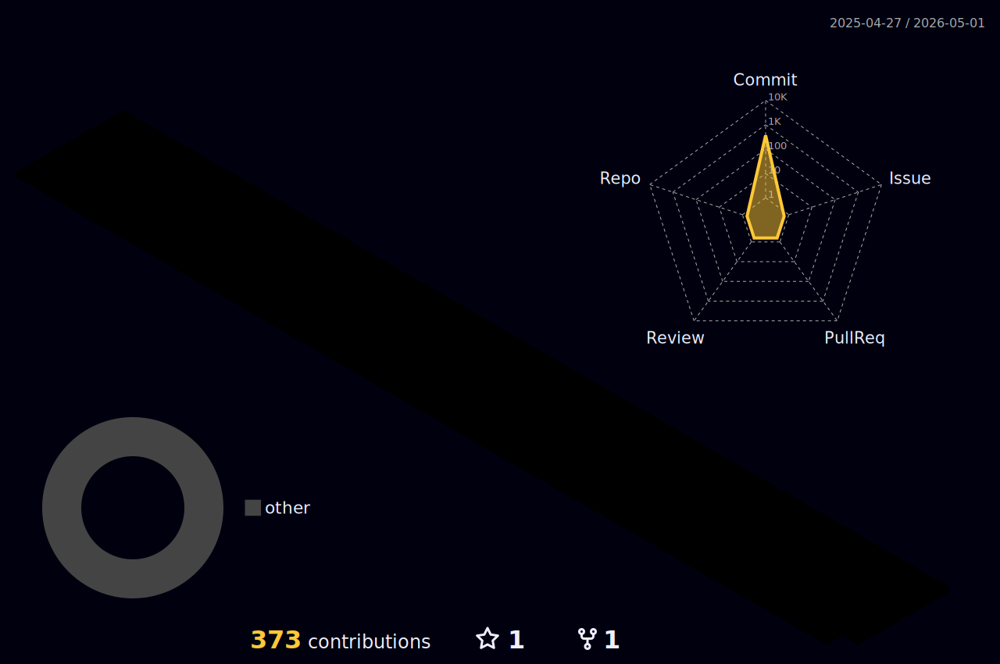

<!-- 헤더 -->

## 🧑🏻‍💻 About Me
- 🖥️ **전공** : Software
- 🚀 **포지션** : Backend/Infra Developer
- 🔮 **팀을 위한 개발자가 되자
 

## 🛠️ 겪어본 기술 스택
### Programming language

### Frontend

### Backend

 

    
## 💡경험
- Vite, Express 기반 모의투자 주식 게임 "모여봐요 주식의 숲" 개발 https://github.com/PDA-4-1
- S투자증권 프로 디지털 아카데미 4기(24.03 ~ )
- React, Spring 기반 유아전용 인공지능 챗봇 "아이행봇해"(23.03 ~ 23.09) https://github.com/iHangbot
- React, Spring 기반 서울시 사건·사고 실시간 모아보기 웹서비스 "삐용삐용"(22.09 ~ 22.12) https://github.com/bbiyongbbiyong
- YOLO알고리즘과 Unity 3D 엔진을 활용한 시각장애인용 실내 음성 안내 내비게이션(19.09 ~ 19.12)
- 2019 청사진 아이디어톤(19.06)
- OO대학교 소프트웨어학부 재학(18.02 ~ 24.02)

 

## 📑 프로젝트 요약

### Vite, Express 기반 모의투자 주식 게임 "모여봐요 주식의 숲"

  
  

#### 기술스택
Vite, tailwind CSS, redux, Express, AWS, Docker, Nginx
#### 역할
- 인프라 구성 및 풀스택 개발
- AWS EC2, RDS, S3와 Nginx를 통한 24시간 서비스 구동
- Docker와 Github Action을 통한 CI/CD 구축
- API 서버 개발
- Three.js 및 Vite를 통한 컴포넌트 개발

 

    
## GitHub Stats

 

<!-- 잔디 내역 3D로 만드셨는데 너무 신기하고 멋있어요!

다양한 경험을 해보신 것 같은데, 함께 공부해보면 좋을 것 같아요😊😊 -->
