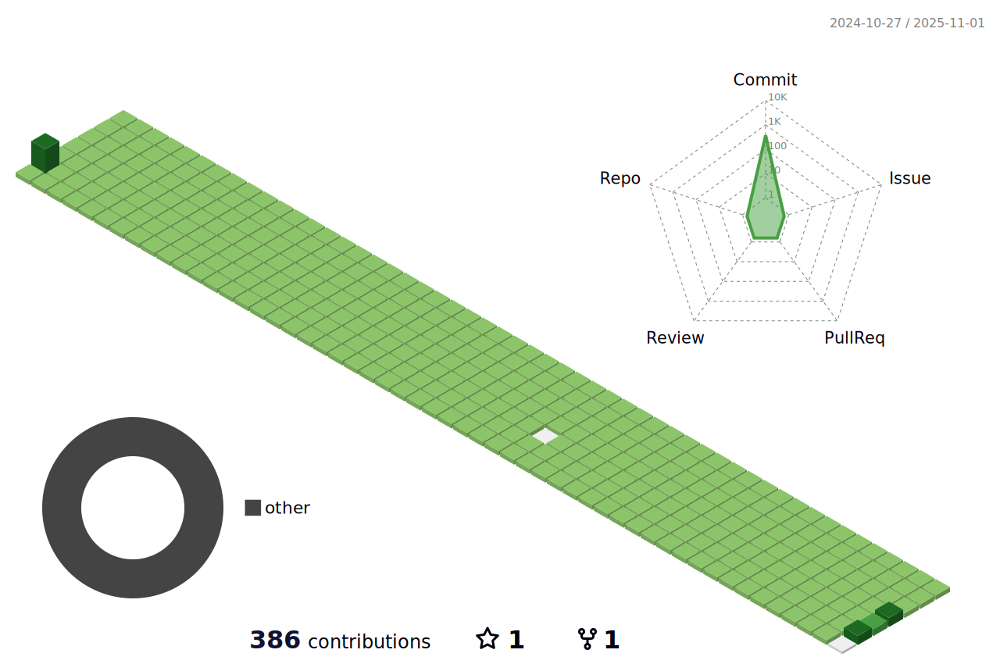

<!-- 헤더 -->

## 🧑🏻‍💻 About Me
- 🖥️ Major : Software
- 🧲 Interest : Backend Developer
- 🔮 The developer I want to be : Don't be Fool Stack Developer, be a Full Stack Developer.

 
 

## 🛠️ Tech I Used
- Programming language :     
- Frontend : 
- Backend :

 
 

    
## Experience
- 신한투자증권 프로 디지털 아카데미 4기(24.03 - )
- 유아전용 인공지능 챗봇 "아이행봇해"(23.03 - 23.09)
- 서울시 사건·사고 실시간 모아보기 웹서비스 "삐용삐용"(22.09 - 22.12)
- YOLO알고리즘과 Unity 3D 엔진을 활용한 시각장애인용 실내 음성 안내 내비게이션(19.09 - 19.12)

 
 

    
## GitHub Stats

 
 

